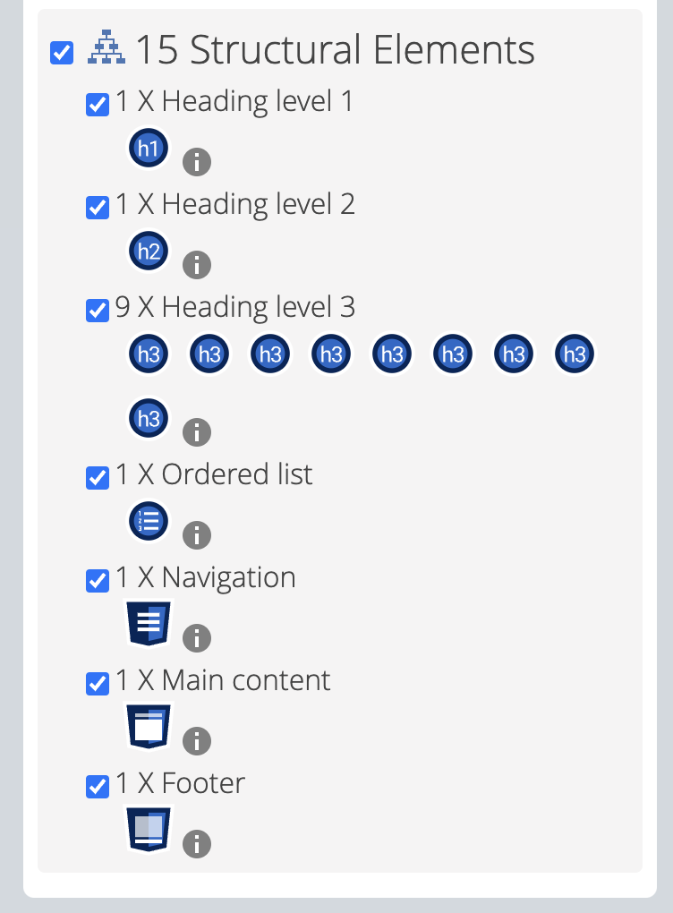
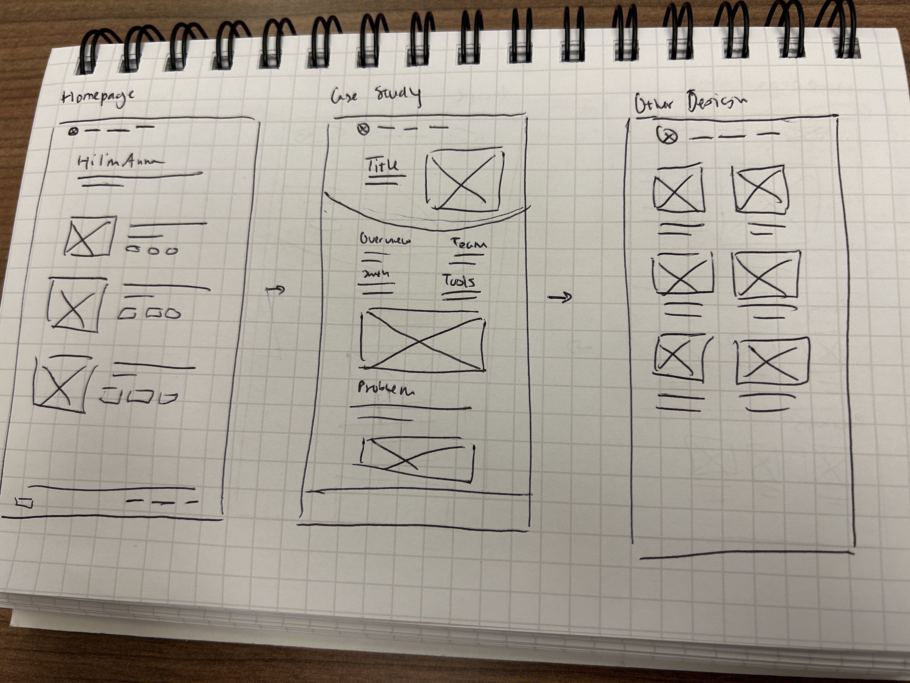

<mark>**Note that this document order from FP4 -> FP1**</mark>

<mark>Please sign up for the study</mark> at [https://tinyurl.com/pui-study](https://tinyurl.com/pui-study) to allow us to use your submission to create a better GenAI assistant for designers!

---

# **FP4 \- Final Project Writeup**

Feel free to refer to this [Markdown Cheat Sheet](https://www.markdownguide.org/cheat-sheet/) to make your writeup more organized, and you can preview your markdown file in VSCode [Markdown editing with Visual Studio Code](https://code.visualstudio.com/docs/languages/markdown#_markdown-preview). 

## Part 1: Website Description

Describe your website (300 words).

* What is the purpose of your website?   
* Who is the target audience?  
* What information do you convey with your website?   
* How is it interesting and engaging? 

The purpose of my website is to act as my personal portfolio for my UX work. This portfolio will be used when I apply to jobs or other opportunities where I need to showcase my work. 

The target audience is recruiters, hiring managers, and also myself as I would be a primary user of my own website. This audience, excluding myself, would most likely spend minimal time on my website. Thus, it's important that the design of my website would need to be extremely clear and In my website, I aim to convey that I am a product designer with strong visual, product design, and reserach skills. The design of the website itself is an opportunity to showcase that information. On the website, the user will be able to view my different projects and see my resume. The individual project pages will have details about the timeline and a brief overview of the project. Due to the time constriction for this project, the individual project pages are shorter than they normally would be, but showcase how the beginning of each individual project would look like.

This website showcases a lot of fun, small interactions that help the website be fun and engaging. There are small animations with my playful flowers as well as some hover animations that make the website more interactive as there is feedback on hover. Finally, the website offers a scroll to top button and image enlarger which acts as fun and helpful interactions for the user for the individual projects. The webiste is also engaging through my digitally drawn flowers, use of color, andthe unique images that showcase my UX work.

## Part 2: User Interaction

How a user would interact with your website? For each step, briefly but clearly state the interaction type & how we should reproduce it.

1. Interaction type. Click on X on page Y / scroll on page X, etc.  
2. Load. Load homepage. (top left flower should "bloom")
3. Load. Load homepage. (the purple and blue flower should have a raise spinning animation)
4. Hover. Hover on navbar tabs. (a line should dynamically appear when you hover)
5. Hover. Hover on footer links in bottom right (an underline should appear on idnvidual links)
5. Hover. Hover on any of the project images on homepage. (the image should slightly expand)
6. Load. Load any individual project page. (content appearing animation)
7. Click. Click on down arrow on homepage. (page should automatically scroll to projects)
8. Scroll. Scroll on any page. (a up arrow should appear in bottom right corner)
9. Click. Click on up arrow in bottom right corner of any page. (the page should automatically srcoll to the top)
10. Click. Click on images in individual project pages (not the cover image). (the image should maximize)
11. Scroll. Scroll once the image is maximized. (the image should automatically return to normal size)

## Part 3: External Tool

Describe what important external tool you used (JavaScript library, Web API, animations, or other). Following the bulleted list format below, reply to each of the prompts.

1. Name of tool1  
   * Why did you choose to use it over other alternatives? (2 sentences max)  
   * How you used it? (2 sentences max)  
   * What does it add to your website? (2 sentences max)  
2. Name of tool2

1. React.js

I wanted to use React to familiarize myself with the framework as I know most developers in the real world would not be coding in vanilla JS. In addition, I think using React would also help me simplify some things as opposed to not using it. I used it for the entirety of the proect. It doesn't necessarily add anything directly to my website but more for the actual code. 

2. Motion (JS animation library)

I chose to use Motion because it helped simplify adding animations to my website. Motion offered alot of functions that were easy to understand from its documents as opposed to other JS libraries. I used it for load, scroll, and hover animations. It makes my website more fun and engaging to interact with.

## Part 4: Design Iteration

Describe how you iterated on your prototypes, if at all, including any changes you made to your original design while you were implementing your website and the rationale for the changes. (4-8 sentences max)

During group critique session in lab, the main suggestion that was made was to include my digitally drawn flowers with the project names in order to maintain the same appeal as the hero section. I decided to include this as I thought that it would help the visual appeal of the website as you scrolled. In addition, when I did the user testing, there was an expectation that clicking the down arrow on the homepage would make it automatically scroll. I also added that to my implemenation of the website. Otherwise, there was relatively minimal critique on the design of the website. 

## Part 5: Implementation Challenge

What challenges did you experience in implementing your website? (2-4 sentences max)

The main challenges I had while implementing was responsiveness and routing issues when using React. In my individual project pages, I had included a different colored background at the top of the page, and that was extremely difficult to deal with for responsiveness. For routing, there were some complications with React and I referred to Lab E instructions for help.

## Part 6: Generative AI Use and Reflection

Describe how you used Generative AI tools to create this final project (fill in the following information, write \~500 words in total).

Document your use of all GenAI tools — ChatGPT, Copilot, Claude, Cursor, etc. using the template below. Add/Delete rows or bullet points if needed, and replace Tool1/Tool2 with the name of the tool.

### Usage Experiences by Project Aspects

Feel free to edit the column \_ (other?) or add more columns if there's any other aspect in your project you've used the GenAI tools for.

For the following aspects of your project, edit the corresponding table cell to answer:
- *Usage*: Whether you used / did not use this tool for the aspect. Enter [Yes/No]
- *Productivity*: Give a rating on whether this tool makes your productivity for X aspect [1-Much Reduced, 2-Reduced, 3-Slightly Reduced, 4-Not Reduced nor Improved, 5-Slightly Improved, 6-Improved, 7-Much Improved].

| Tool Name | Ratings | design | plan | write code | debug | \_ (other?) |
| :---- | :---- | :---- | :---- | :---- | :---- | :---- |
| Tool1 | Usage | Yes/No | Yes/No | Yes/No | Yes/No | Yes/No |
| Tool1 | Productivity | 1~7 | 1~7 | 1~7 | 1~7 | 1~7 |
| Tool2| Usage | Yes/No | Yes/No | Yes/No | Yes/No | Yes/No |
| Tool2 | Productivity | 1~7 | 1~7 | 1~7 | 1~7 | 1~7 |

Github CoPilot | Usage | No | No | No | Yes | No
Productivity | Productivity | N/A  | N/A | N/A | 6 | N/A

### Usage Reflection

> Impact on your design and plan 
* It matched my expectations and plan in [FP2](#generative-ai-use-plan) in that … For example, 
  1. Tool1: Github CoPilot

In my initial plan, I decided that I would use Github CoPilot sparingly and I did exactly that. When I feel stuck when I'm writing code, my first instinct is to look it up online rather than asking Github CoPilot. I think I'm wary of excessive code that it may output so I would rather try to figure it out on my own instead. I only used Github CoPilot once to consider the hovering for the navigation bar at the top of the page.

* It did not match my expectations and plan in [FP2](#generative-ai-use-plan) in that … For example, 
  1. Tool1: ChatGPT

I ended up not using ChatGPT at all becuase I didn't need it to generate words for me because I had already written down alot of the text I would use for the portfolio. I also chose not to ask it coding questions because I would either figure it out on my own or ask the TA or others for advice.

> Use patterns
* I accepted the generations when …  For example, 
  1. Tool1: this tool once suggested … and I adjusted my design according to the suggestion because … 
  2. Tool2: 
* I critiqued/evaluated the generated suggestions by … For example, 
  1. Tool1: this tool once suggested … but I modified/rejected the suggestion because … 
  2. Tool2: 

  I accepted one generation of code by Github CoPilot. The tool gave a suggestion for how to create a dynamic underline on hover for the nagivation bar. The code that it gave produced a line that was off-centered so I asked it to generate the line in the middle. From there, I modified the code based on which lines of code were actually necessary for the hover animation to work.

> Pros and cons of using GenAI tools
* Pros
  1. Tool1: Github CoPilot
     It was nice that Github CoPilot was able to generate actual code based off of text input.
* Cons
  1. Tool1: Github CoPilot
     There was some random code that didn't do anything for the output.

### Usage Log

Document the usage logs (prompts and chat history links) for the GenAI tools you used. Some tools may not have an easy way to share usage logs, just try your best! Some instructions for different tools:

1. Github Copilot prompts: "make an underline that expands on hover", "move the line to the middle"

### Appendix:

Screen Sizes to test on: Desktop (1470x956), iPad Pro (1024 x 1366) or horizontal (1366 x 1024)

Screenshots from Wave:

Homepage

Faculty Activity Tracker (FAT) Project Page

Mindful Project Page

Penella Project Page

---

# **FP3 \- Final Project Check-in**

Document the changes and progress of your project. How have you followed or changed your implementation & GenAI use plan and why? Remember to commit your code to save your progress.

## Implementation Plan Updates

- at this stage of the project, I had initially decided against using React.js which was written in my FP2. I also decided that I wouldn't be able to implement every single page of my portfolio so I decided to limit it to the homepage and the individual project pages. Here I was also informed by my TA that I needed to add some kind of functionality beyond some JS library produced interactions. So, my next step was figuring out what kind of functionality would make sense for my portfolio without ruining the user experience aspect of the portfolio. Something that I could add to help my portfolio rather than just added as part of the requirements for the final project.

## Generative AI Use Plan Updates

At this point, I realized I wouldn't actually be using ChatGPT for help for writing my words as I already had a lot of written words from my previous portfolio. In addition, in terms of Github CoPilot, I didn't need to use it while coding so perhaps I won't be using any Generative AI for this project.

Remember to keep track of your prompts and usage for [FP4 writeup](#part-6-generative-ai-use-and-reflection).

---

# **FP2 \- Evaluation of the Final project**

## Project Description

Briefly restate your motivation and a short description of your project.

I want to create a personal portfolio as my project in order to jump-start coding my own website for
ultimate customization. My personal portoflio will consist of a homepage, case study pages, an about
page, etc. This portfolio will be used to showcase my Product/UX design work. 

## High-Fi Prototypes

### *Prototype 1*

For the homepage, my two evaluators mentioned how liked the color scheme and the gradient of the
background for the hero section. One user specifically thought that the arrow on the hero section
was clickable and automatically scroll down the page for her. The other evaluator liked how the
tags showed what each case study was about. However, based on how they looked, he was unsure if they
were clickable or not. They also thought the gradient to black background was slightly jarring.

### *Prototype 2*

For the case study page, the evaluators both mentioned that they liked that I used different colors 
to categorize the different sections. They both mentioned that the first image blended into the 
background a bit. One of the evaluators mentioned that the white to black bacground transition seemed 
jarring. 

https://www.figma.com/proto/j2KQD5n7Iu1W2XclaOTQGP/Portfolio-Things?page-id=1416%3A2&node-id=1713-288&node-type=frame&viewport=-423%2C-1712%2C0.27&t=QDPUsXJj6JobY7oo-1&scaling=min-zoom&content-scaling=fixed&starting-point-node-id=1713%

## Usability Test

For the user feedback I got during my evaluations and usability test, I carefully thought through
their feedback and considered what ideas/critiques I should carry into my future designs. 

For the homepage, I decided to include the interaction that one of my evaluators assumed existed. Her
surprise that the button didn't do anything made it clear to me that this may be a common assumption
based on existing webpages out in the world. Also, I thought by including this interaction it may
make the change from gradient to black background more seamless. This will in turn, fix the issue
that one of the other evaluators pointed out: the gradient to black background seemed a bit odd. 
Furthermore, one of the evaluators had mentioned that the tags almost seemed clickable. Thus, I thought
this was a big problem and decided to make these tags rounder to afford a more tag-like apperance. I 
also made the tags a different color so they would have a different hierarchy of performance compared
to the other text in that area.

For the case study page, their main critique was about the initial image on top of the white background.
To fix this issue, I decided to add a shadow to the intial image in order to differentiate the 
image from the background. For the other evaluator's critique about the change from black to white
background, I think my solution helped fix the issue a bit. Additionally, I decided that I didn't 
think the change from black to white was jarring enough to completely change.

## Updated Designs

As mentioned before, for the updated homepage I decided to add the interaction component with the
down arrow in the hero section. I also decided to change the look of the tags so that they would
seem more like tags. Thus, this updated design features more rounded buttons and an additional
interaction with the arrow component. 

For the case study page, the main feedback I had received was on the initial image at the beginning
of the page. My updated design adds a shadow to the initial image to separate the image from the
light background and distinguish where the image ends and where the page begins. Other parts of the
design were not changed as there was no negative feedback aimed at the rest of the page.

https://www.figma.com/proto/j2KQD5n7Iu1W2XclaOTQGP/Portfolio-Things?page-id=1416%3A2&node-id=1751-478&node-type=frame&viewport=-423%2C-1712%2C0.27&t=QDPUsXJj6JobY7oo-1&scaling=min-zoom&content-scaling=fixed&starting-point-node-id=1713%3A288

## Feedback Summary

During the lab session, I received ample feedback from my classmates. My classmates gave postive 
feedback on the visual design of the portfolio, especially the hero section. One classmated mentioned
that the homepage seemed "gallery-like". 

For the homepage, one classmate also mentioned how the intial hero section seemed very artistic
while the rest of the page felt very functional. So, they recommended that the design of the page
could stay more consistent, perhaps by adding flowers to the titles of the projects. In keeping 
with the idea of consistency, they noted that in my portfolio it seemed that my primary color was
pink so I should try to be consistent with where I decide to use that color. Furthermore, along the
lines of color, they mentioned that they could tell that my "take a look" button colors were taken
from the background of the case study image, but it could be more consistent. 

From these critiques, I decided that I did want the artistic style of the homepage hero section to 
continue throughout the rest of the page. Thus, I decided to take my classmate's advice and add my
little flower design to the titles of my case studies. I also noted what they thought was my primary
color, and will certainly keep that in mind for further development of my portfolio when I consider
what colros to use. For the "take a look" buttons, they didn't have too big of a problem with it, so
I decided to keep it the way it is, but I may it change it later if needed. 

Finally, for the case study page, my classmates didn't find the black to white jarring, which 
re-affirmed my previous assumption that it wasn't necessary to change the background color there.
However, they did mention that keeping some kind of gradient from the homepage to the case study page
could make the transition easier. I think I am still considering this possible design, so it's 
possible that will be added.

## Milestones

For my weekly milestones, I'm planning on finishing FP3 for next week, finalizing my designs and
beginning to build an HTML-level webpage to start laying out my designs. For the week of November 11th
to November 15th, I plan to continue my HTML layouts, and start adding CSS + JavaScript while 
researching the JS libraries and figuring out houw to use them. 

Then, for the week fo November 18th to November 22nd, I will finish up adding CSS, 
JavaScript, and try adding the JS libraries. I expect that CSS will be easy to add since I would have
already defined the colors within my designs, so I would just need to add the CSS in the right places.
The JavaScript and the JS libraries would most likely take up the bulk of my time during this week.
I am also considering adding some additional interactive features, such as a progress bar or a 
return to top button that could potentially be more complicated. 

Finally, for the week of November 25th to November 29th, I assume that I will need some time to
finish up the project, tie up any loose ends, and figure out any issues I might have. At this point,
I would be looking for interaction issues and inconsistencies that would need fixing. For the week
when the project is due, I would expect to do last-minute changes that are needed.

### *Implementation Plan*

- [ ] Week 9 Oct 28 \- Nov 1:
  - [X] FP1 due
  - [ ] ...
  
- [ ] Week 10 Nov 4 \- Nov 8:   
  - [X] FP2 due
  - [] Finish FP3
  - [] Finalize designs
  - [] Start builidng HTML-level model of web-portfolio

- [ ] Week 11 Nov 11 \- Nov 15:  
  - [] Continue building HTML-level model of web-portfolio
  - [] Start on CSS + JavaScript
  - [] Start researching the JS libraries
- [ ] Week 12 Nov 18 \- Nov 22:   
  - [] Finish up CSS + JavaScript
  - [] Try adding JS library stuff
- [ ] Week 13 Nov 25 \- Nov 29:  
  - [] Continuing working on project overall

  - [ ] Thanksgiving  

- [ ] Week 14 Dec 2 \- Dec 6: 
  - [] finish any last minute changes 
  - [ ] FP4 due 

### *Libraries and Other Components*

List the JS libraries and other components (if applicable) that you plan to use. 

1. Textillate.js
2. React.js
3. Anim.js

## Generative AI Use Plan

I plan to use Generative AI relatively sparingly when aiding implementation. I will most likely use
ChatGPT the most often, either when I'm stuck or I need help with wording text on the actual website. 
I haven't used ChatGPT much for coding questions in the past, so I'm intrigued if it'll be able to 
answer accurately. I also plan to use ChatGPT to help me better understand the JS libraries I'm using
and see if its explannations will help me. Additionally, I will try out GitHub Copilot, but I may 
choose to not use it if I'm not understanding the code it's producing. I want to focus on actually 
learning what I'm coding, so if Github Copilot doesn't allow me to do that, I will not use it anymore. I have heard that it is helpful, especially for autocompleting when coding.

As mentioned before, I don't plan on using Generative AI tools much when creating this project becuase
I don't particularly like using Generative AI frequently. Occasionally, the tools are helpful when
I'm stuck or I need more ideas, but I do feel that it has its limits. Thus, I can't speak much on
how I plan to use the Generative AI tools since I have no interest in using it that much.

### *Tool Use*

* ChatGPT  
  * I will use it for ideas on how to word certain parts of my portfolio because it can help me easily
    write things for my portfolio.  
  * I will potentially use it to help me understand JS libraries because it could explain it in a 
    summarized fashion.
  * I will not use Github Copilot for complex coding problems because it may not be helpful.
* GitHub Copilot
  * I will not use Github Copilot if I don't understand the code that it's giving me.
  * I will use it to help me autocomplete functions becuase it will help me code faster.  
* ...

### *Responsible Use*

How would you use Generative AI responsibly? 

I would use it to help assist me in my implementation, and I would make sure that I understand the
content it produces. I would not use Generative AI to completely do my assignment for me or use code
created by Gen AI that I don't understand.

---

# **FP1 \- Proposal for Critique**

## Idea Sketches

### *Idea 1*

My first idea is a website portfolio to showcase my UX work. I plan to make my design interactive
by adding interactions such as zooming in on pictures after clicking, and fun engaging animations
that happen when the user first enters the site or scrolls. For accessibility, I plan to tag all 
of my images properly and employing best coding practices when creating a hierarchy within my code.
I will also make sure that all text is accessibly to different assistive technologies. I want 
my website to include information about my different projects, resume, and overall convey that I 
would be a good person to hire as a UX desginer.

### *Idea 2*

My second idea is a food blog that will showcase my family's recipes. My family has a lot of recipes
and they aren't written down anywhere so this is a good opportunity to organize them. I plan to make 
my designinteractive and engaging by allowing users to check off recipe ingredients/steps, and 
creating buttons that allow users to skip ahead to the recipe. I will make my design accessible by 
making sure my code/design works witih assistive technologies, and that content is easily skipable. 
This is especially important for this idea as the content will most likely be long.

### *Idea 3*

My third idea is a restaurant dictionary for the city of Boston. I used to live in Boston and there
were always so many restaurants to keep track of. The website would offer insights for new restaurants 
in town as well as different categories and rankings to browse. This website would be interactive 
and engaging through reviews that the user could leave, and voting for their favorite restaurnts. I 
will make the website accessible by making sure that the design and code follow good standards and 
allow users to equally use the website.

## Feedback Summary

For the portfolio project, my classmates gave me suggestions on how to make the website more memorable 
and personable. One of my classmates suggested that I add animations to mkae it more personal to grab 
the user's attention. She mentioned that this would also be a good way to make the website more
memorable. Another classmate suggested that I could make the website more personal through images and
words that represent what I like or show my personality. The third classmate highlighted the importance
of having a balance between jargon and my own voice. 

For the food blog project, my classmates had unique takes for the overall design of the website. 
One classmate suggested that I would need to focus more on user research in order to distinguish the
design of my website from others. Another classmate suggested a more interactive interface, such as 
a digitized notecard recipe file system. This would be similar to and old-fashioned way to note down 
recipes that could be whimsical in digital format. Finally, the last classmate suggested a more clear 
organization system for the different recipes, and suggested thinking deeper about the genres of
these recipes. 

For the restaurant dictionary project, my classmates gave input on the interactions of the website. 
One classmate suggested a clearer way for the user to find the vibe of restuarant that they're 
looking for when they're on the website. This is important to consider as food is not the only 
consideration people have when deciding where to eat. Another suggested making the interface more fun 
by first considering the neighborhood within the city that someone might choose to eat at. Then, the
website could give more specific recommendations based on location.

## Feedback Digestion

For the portfolio project, I decided would incorporate the idea of adding animations to grab users'
attention. I thought back to all of the portfolios I've seen, and the ones with cooler animations
do stick out to me in my head. I think that's ideal for a portfolio. I also will consider how to make
the website more personable through different images and wording. I think a lot of portfolios can
easily blend together due to their structure and wording, so if I lean more into my own personality
perhaps I can distinguish myself from the back. I also like the idea of showcasing my own voice, as
I know its important to tell a story within my portfolio and case studies.

For the food blog project, I think some user research is important to understand how to make myself
different, but I don't think it should be a main portion of the project. As this project is to 
best practice good coding and usability practices, I think focusing on research would not help me
practice the necessary skills for this class. I also will not go in the direction of interactive 
notecards, since that tradition is not representative of my own culture and the recipes I'm thinking
of. Although, I will incorporate the feedback about a better organization system, since I feel most
users would not like a random conglomerate of recipes.

For the restaurant dictionary, I will take the critique of finding a better way for users to search
for a specific type of restaurant. If anything, I agree users most likley have an idea of how much
they want to spend and the type of cuisine they want to eat. Furthermore, I want to incorporate
the idea of starting with different neighborhoods, but I worry that could limit the users' ability
to find different restuarants. I think a better idea would be if the user could select multiple
neighborhoods at once to see more recommendations.